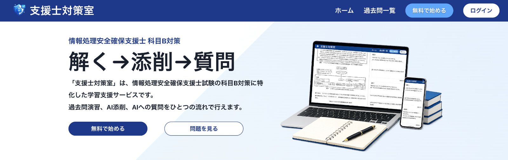
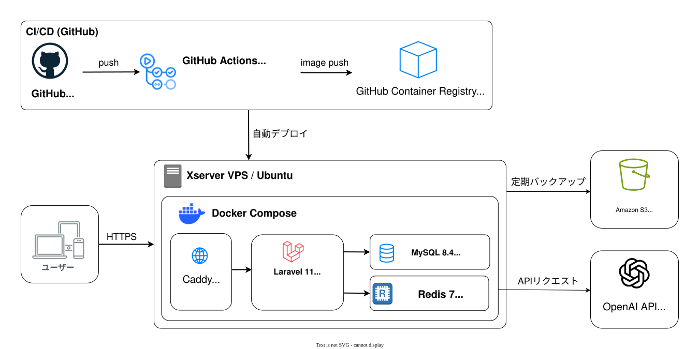
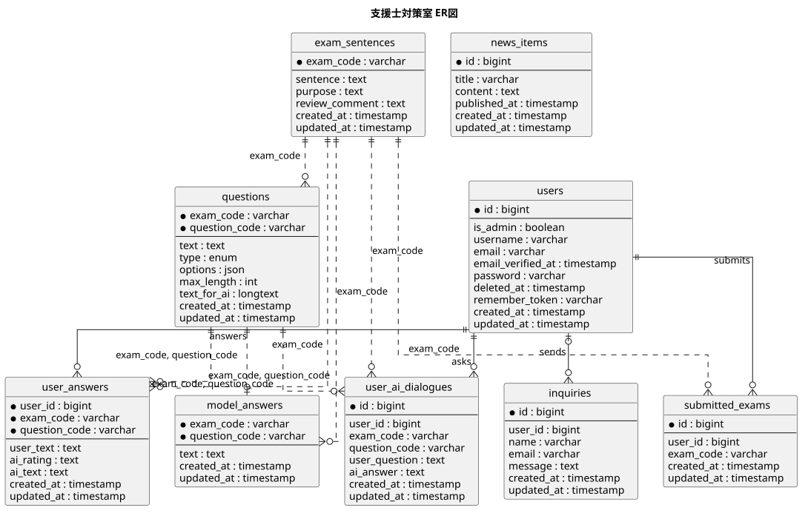

# 情報処理安全確保支援士試験学習アプリ 支援士対策室

## アプリURL

https://shienshi.com

    

## 目次

1. [概要](#概要)
1. [開発の背景](#開発の背景)
1. [主な機能](#主な機能)
1. [使用技術](#使用技術)
1. [システム構成図](#システム構成図)
1. [ER図](#er図)
1. [テスト](#テスト)
1. [工夫した点](#工夫した点)
1. [今後の改善点](#今後の改善点)

## 概要

情報処理安全確保支援士の科目B試験（旧午後試験）の対策を支援する学習アプリです。

過去問PDFを閲覧しながら答案を入力し、問題文・設問・模範解答を踏まえたAIによる添削や、試験内容に関する質問ができます。

### デモユーザー

以下のユーザーはご自由にお使いください。

ユーザーID: `public_user`

パスワード: `password`

※デモユーザーの投稿は、他のデモユーザー利用者からも閲覧できます。投稿内容は毎日、定期処理で削除されます。

## 開発の背景

私は情報処理安全確保支援士試験の学習でAIを活用し、疑問点を整理したり、自分の理解を言葉にして確認したりすることで、IT業界未経験ながら合格することができました。

一方で、一般的なAIは試験問題や模範解答をあらかじめ把握していないため、実際の過去問について質問するには、その都度問題文や設問を説明する必要がありました。

また、情報処理安全確保支援士試験の記述式問題では、単に正しい知識を持っているだけでは十分ではありません。多くの知識を正確に身につけたうえで、問題文の状況に合わせて必要な情報を読み取り、限られた文字数で適切な答案として表現する力が求められます。

この力を身につけるためには、実際の過去問を繰り返し解き、記述形式に慣れることが欠かせません。しかし、独学では、自分が作成した答案について客観的なフィードバックを得る機会が少なく、答案のどこが不足しているのか、どのように改善すればよいのかを判断しにくいという課題があります。

そこで、過去問を画面上で確認しながら答案を入力でき、問題文・設問・模範解答を踏まえたAIのフィードバックを受けられる学習アプリを開発しました。

本アプリでは、実際の試験問題を通して知識を記述答案へ落とし込む練習を支援することを目的としています。

## 主な機能

- 過去問PDFを閲覧しながら答案を入力
- 過去問PDFへのハイライト表示
- 問題文・設問・模範解答を踏まえたAIによる答案添削
- 設問についてAIに質問できる機能
- 回答内容と添削結果の保存・再表示
- ユーザー登録・ログイン・パスワード変更
- 管理画面からの問題・模範解答・PDFの登録

## 使用技術

### フロントエンド

- React 18
- TypeScript
- Vite
- Chakra UI
- TanStack Query
- Jotai
- React Hook Form
- react-pdf

### バックエンド

- PHP 8.3
- Laravel 11
- Laravel Sanctum
- Laravel Fortify
- OpenAI API

### データベース・キャッシュ

- MySQL 8.4
- Redis 7

### インフラ・開発環境

- Docker / Docker Compose
- Caddy 2
- Xserver VPS
- GitHub Actions
- GitHub Container Registry

### テスト・品質管理

- PHPUnit
- Laravel Pint
- PHPStan / Larastan
- TypeScript typecheck
- Composer Audit
- npm audit

## システム構成図

フロントエンドとバックエンドは、Dockerコンテナで構成した同一VPS上の環境で稼働しています。

GitHub Actionsで依存関係監査、静的解析、テスト、Dockerイメージのビルドを行い、GitHub Container Registryを経由してVPSへデプロイしています。

    

## ER図

    

## テスト

PHPUnitを使用し、主に以下の処理をテストしています。

- 認証・認可
- 過去問および答案データの取得
- AI添削結果の保存
- AI処理の多重実行防止
- バリデーションエラー
- データが存在しない場合のエラー処理

GitHub Actions上でもテストを実行し、テストに成功した場合のみDockerイメージを作成しています。

## 工夫した点

### ReactとLaravelによるSPA構成

OpenAI APIを利用した答案添削には一定の待ち時間が発生するため、ReactとLaravelによるSPAとして開発しました。

添削中も過去問PDFや入力内容を画面に残し、ローディング表示で処理状況を示すことで、学習中の文脈を保ったまま結果を待てるようにしています。

### 問題情報を踏まえたAI添削

利用者の答案だけでなく、問題文・設問・模範解答をOpenAI APIへ送信し、試験問題の文脈を踏まえた添削ができるようにしました。

未回答の設問も含め、各答案に評価と改善コメントを返します。

### AI応答の構造化と検証

AIの応答は、設問コード・評価・コメントを持つ構造化データとして取得しています。

取得したデータはバックエンドで形式や評価値を確認し、不正な値を補正・除外してから保存することで、画面表示やデータベースへの保存を安定させています。

### Redisを利用した多重実行防止

AI処理には時間とAPI利用料がかかるため、Redisのロックを利用し、ユーザー単位で重複実行を防止しています。

フロントエンドでのボタン制御に加え、バックエンド側でも多重送信を制御しています。

### DockerとGitHub Actionsによる開発・デプロイ環境

Laravel、Caddy、MySQL、RedisをDocker Composeで構成し、開発環境と本番環境の差を小さくしています。

GitHub Actionsで依存関係監査、静的解析、テスト、ビルドを行い、成功した場合のみDockerイメージをGitHub Container Registryへ登録しています。

## 今後の改善点

- 直近に実施された試験問題・模範解答の追加
- 試験本文を一括送信する現在の方式と、RAGで関連箇所のみを取得する方式について、添削精度とAPI利用料を比較し、最適な構成を検討
- 添削履歴や設問ごとの結果を利用した、苦手分野・学習状況の可視化
